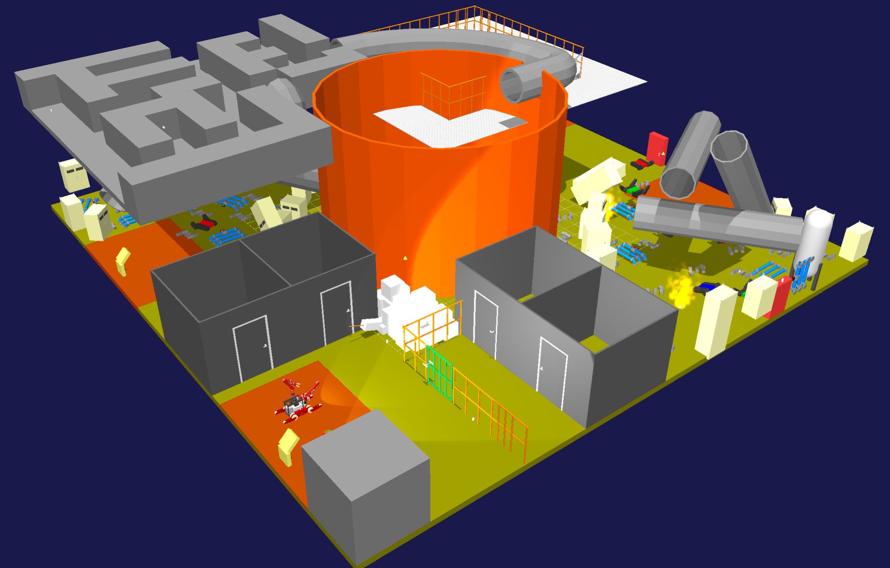
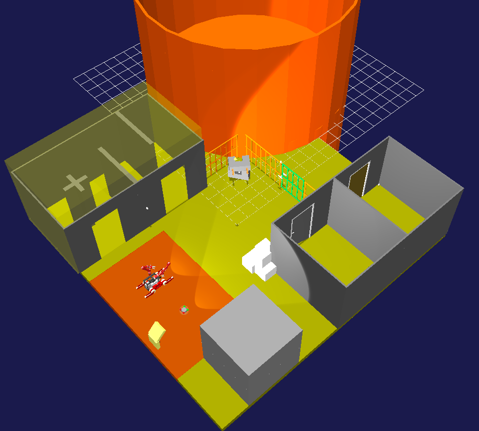
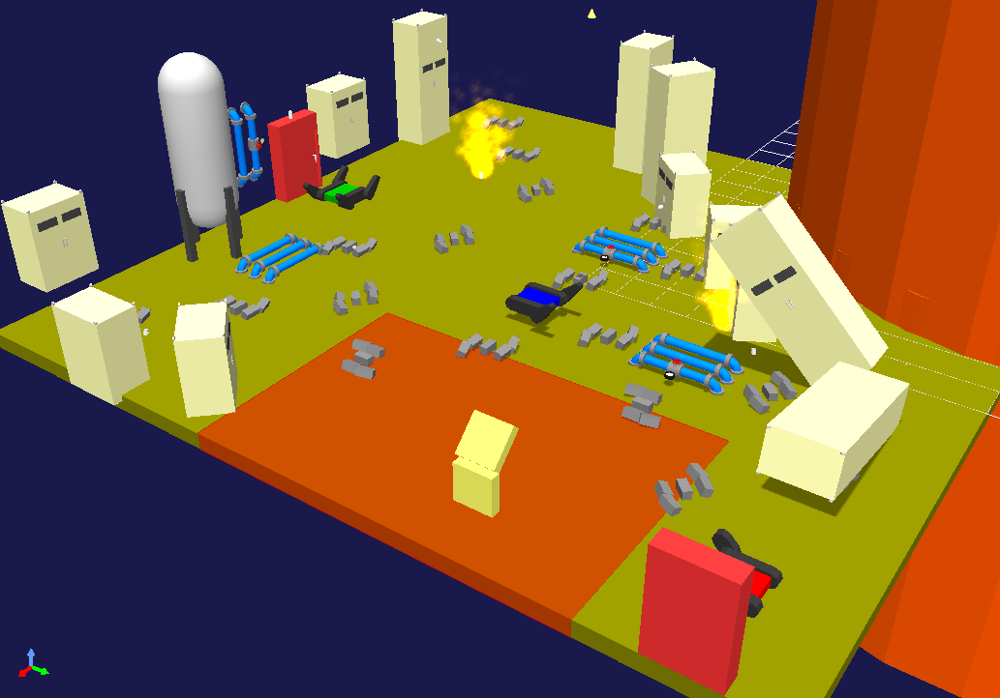
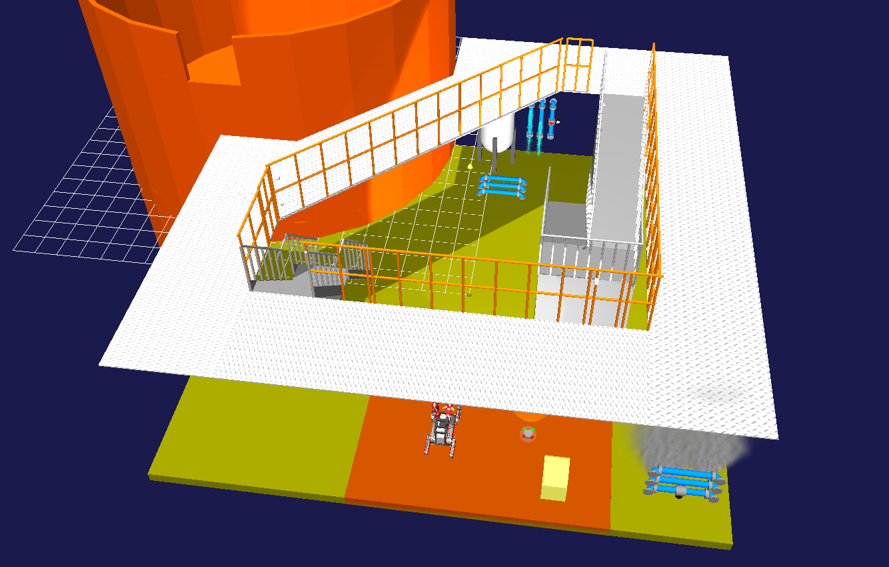
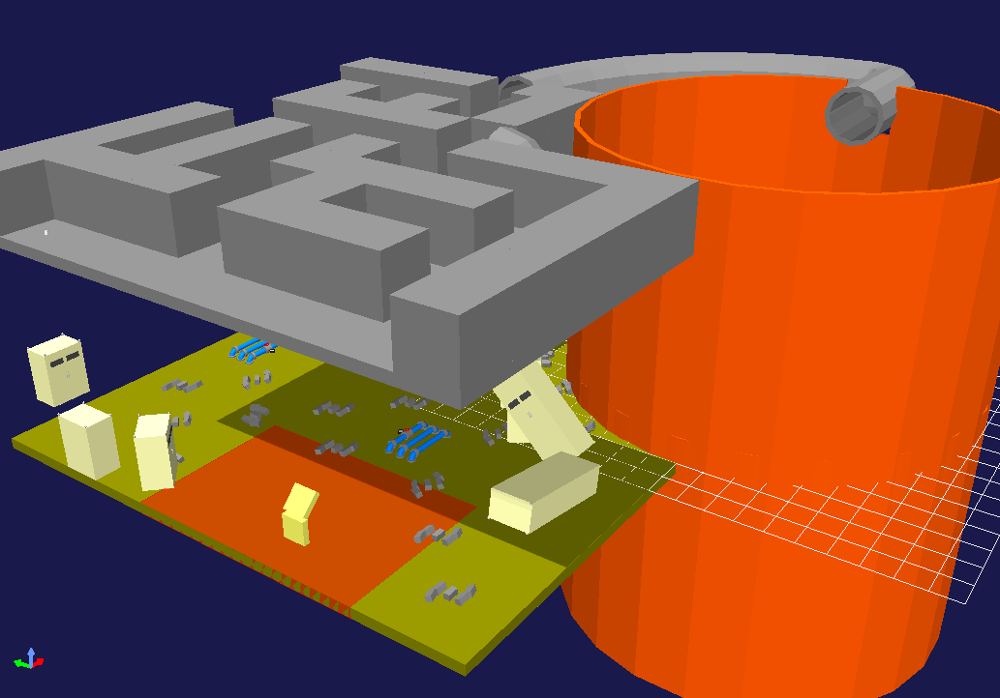
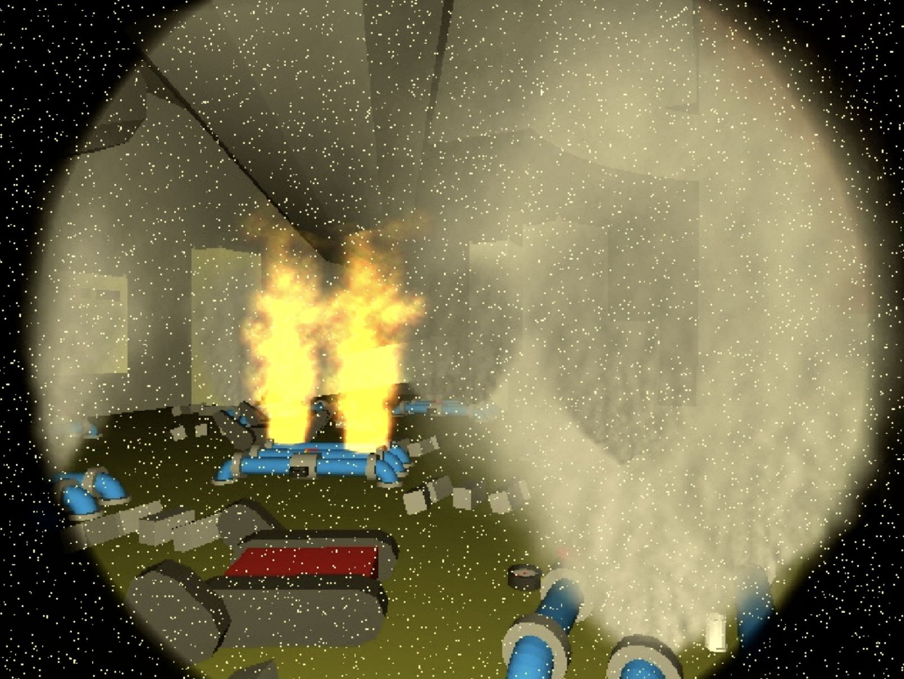
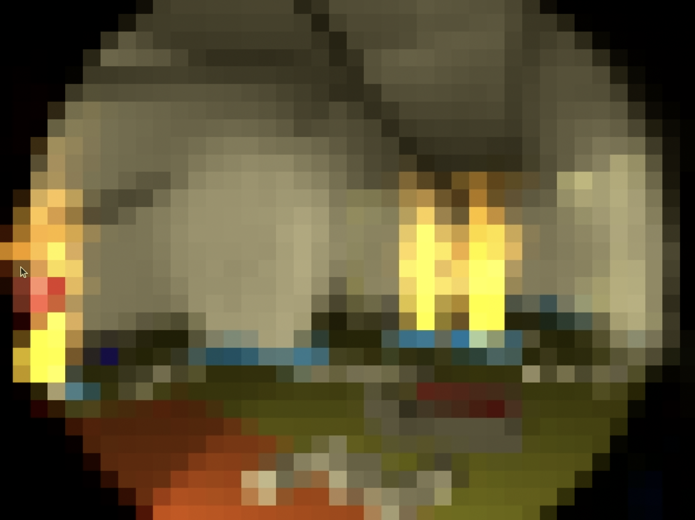
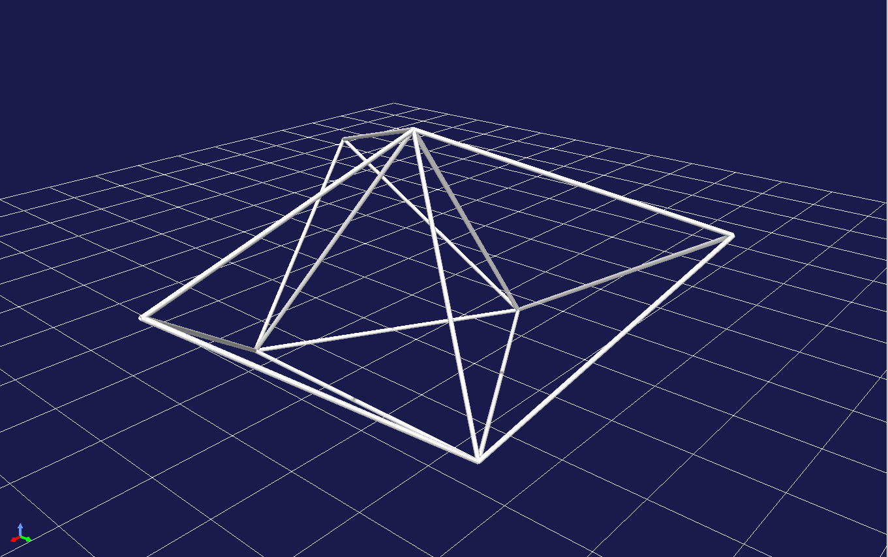

# World Robot Summit 2025 Harsh Environment F-REI Challenge, Simulation Disaster Challenge Official GitHub

## Overview
The competition at the tournament is set up with the scenario of “Information gathering and emergency response in a harsh environment, assuming a plant disaster".

## Task（Regularly update）
- We currently have built a simulation environment that takes into account the tasks required for disaster response.
- We have uploaded a simplified course that will allow you to perform each task in the future.

## New information（Update: August 29th, 2025）
- The simulation environment consisted of four areas, Area 1 to Area 4, as shown below. The competition was divided into each area.
 


#### Area 1: Lever control, Turning on the light, Opening the door
 

- The area around the start (Click on the image to view simulation on youtube)

[](https://youtu.be/-OKpuWwvyP4) 

##### Scenario
You use a remote-controlled robot to explore an area where objects are scattered after a plant accident. Since the area is dark, the robot can turn on lights by operating switches to illuminate the area. It will open doors and explore small rooms. To explore the area, the robot must read as many QR codes scattered throughout the area as possible and return to the starting point within the time limit. This area is designed to measure the robot's mobility, operability, and exploration capabilities. Additionally, it is necessary to consider the possibility of limited visibility due to communication issues caused by remote operation, as well as the possibility of sudden power outages.

#### Area 2: Firefighting
 

- The area around the start (Click on the image to view simulation on youtube)

[](https://youtu.be/RqlraRtlhWA) 


##### Scenario
You must explore this area where objects are scattered after a plant disaster. Since there is a fire in this area, the robots take out a fire hose from the fire extinguisher box and put out the fire. Gases (smoke) and liquids (water) leak from pipes in the area, so the robot can stop the leaking fluids by operating the valves. It is also necessary to read the values of the analog meters installed in the plant.To explore this area, the robot must read as many QR codes scattered throughout the area as possible and return to the starting point within the time limit. This area is constructed to measure the movement, manipulation, and search abilities of the robots. In addition, it is necessary to assume that the field of vision will be reduced due to the effects of communication in remote control and that there may be sudden power outages.

#### Area 3: Running up/down stairs and slope 
 

- The area around the start (Click on the image to view simulation on youtube)

[](https://youtu.be/EvLPmafm8BM) 

##### Scenario
You must explore this area where objects are scattered after a plant disaster.
Gases (smoke) and liquids (water) leak from pipes in the area, so the robot can stop the leaking fluids by operating the valves. 
The robots must climb the stairs or ramp, turn the valve on the second floor, and stop the leak.
It is also necessary to read the values of the analog meters installed in the plant. To explore this area, the robot must read as many QR codes scattered throughout the area as possible and return to the starting point within the time limit. This area is constructed to measure the movement, manipulation, and search abilities of the robots. In addition, it is necessary to assume that the field of vision will be reduced due to the effects of communication in remote control and that there may be sudden power outages.

#### Area 4: Entering ducts, tank inspections
 

- The area around the start (Click on the image to view simulation on youtube)

[](https://youtu.be/f4MrvI26BAk) 

##### Scenario
You use the robot, which is UAV, to enter the duct and investigate the tank connected to the duct. The passage connected to the duct is narrow and maze-like, requiring careful exploration to avoid getting lost. On the other hand, Gases (smoke) and liquids (water) leak from pipes in the area, so the UGV can stop the leaking fluids by operating the valves. In order to explore the area, you must read as many QR codes as possible, which are scattered around the area, and move the robot from the start area to the goal area within the time limit. This area is constructed to measure the movement, manipulation and search abilities of the robots. In addition, it is necessary to assume that the field of vision will be reduced due to the effects of communication in remote control, and that there may be sudden power outages.

- As part of the harsh environment challenge, the following video communication noise occasionally occurs. Please operate the robot so that it functions properly, even in the presence of noise.
	- White Noise
	
 
	- Block Noise
	

### Ramp


- The UGV needs to go up and down the ramp.<br>
- The UGV needs to cross the ramp.

### Catwalk


- The UGV needs to pass through the catwalk (narrow aisle).

### Duct


- The UAV enters through the duct and inspects the inside of the tank. (If there is air flow, etc., the robot close the valve first.)

### Stairs


- The UGV needs to go up and down the stairs.

### Meter


- The robot needs to read the value shown on the meter.

### QR code


- You explore the entire area and search for the QR codes as possible. The QR codes are inside the tubes.
  - The robot needs to read them.

### Switch


- The robot needs to press the specified switch.

### Valve, Lever


- The UGV needs to turn the valves and levers.
  - You can stop the fluid that is leaking by turning the valve or lever.
  - The value on the meter may change by turning the valve or lever.

### Door


- The robot needs to open the door and enter the interior.

### Truss field

Go through and explore the truss field with regular tetrahedrons and triangular prisms of pipes.
This object is constructed according to the Standard Disaster Robotics Drone Challenge.
(Ref: Standard Disaster Robotics Drone Challenge Competition field 3, https://wrs.f-rei.go.jp/en/challenge2025/sdrdh.html)

### Fire extinguishing work
#### Step 1:


- The robot needs to open the fire extinguisher door and extract the hose.

#### Step 2:


- The robot needs to extract the nozzle and connect the nozzle and hose.

#### Step 3:


- The robot needs to open the valve inside the fire extinguishing equipment.

#### Step 4:


- The robot needs to pull the nozzle lever to extinguish the fire.

## Simulation Environment

Choreonoid is used as the robot simulator in the World Robot Summit 2025 Simulation Disaster Challenge. Moreover, AGX Dynamics is used as a physics engine.

#### AGX Dynamics installation reference
Before constructing the WRS2025 environmental specifications for Choreonoid, please install this software.
- https://choreonoid.org/en/documents/latest/agxdynamics/install/install-agx-ubuntu.html
- Movie for installation (Click on the image to view simulation on youtube)

[](https://youtu.be/SxmwYl_gPEY) 

#### HAIROWorldPlugin installation reference
Please obtain this software before building Choreonoid's WRS2025 environment specification.
Competitors are requested to contact the competition secretariat.
Others should contact JAEA Suzuki at "suzuki.kenta38※jaea.go.jp" .
（Change the ※ to @ when you send us an email. ）

#### How to install Choreonoid
- Requirements
	- OS: Ubuntu22.04，CPU: amd64 (Intel CPU, Ryzen CPU)
	- ROS2: Humble Hawksbill 
	- Cannot be installed on a virtual environment on an Apple Silicon Mac (because the CPU is arm-based)
- Building Choreonoid for the competitor's computer 
	1. Building Choreonoid Without ROS2 for the first time
	2. Rebuilding Choreonoid Without ROS2 For Pre-competition (Already Choreonoid built)
	3. Building Choreonoid for pre-tournament (with ROS2 integration)


#### 1. Building Choreonoid Without ROS2 for the first time
```bash
$ cd
$ git clone https://github.com/choreonoid/choreonoid.git
$ git clone https://github.com/wrs-frei-simulation/WRS-Pre-2024.git choreonoid/ext/WRS2024PRE
$ git clone https://github.com/wrs-frei-simulation/WRS-2025.git choreonoid/ext/WRS2025
```
- **Move ``hairo-world-plugin`` to ``choreonoid/ext/``.**
```bash
$ choreonoid/misc/script/install-requisites-ubuntu-22.04.sh
$ sudo ./choreonoid/ext/hairo-world-plugin/misc/script/install-requisites-ubuntu-22.04.sh
$ cd ~/choreonoid && mkdir build && cd build
$ cmake .. -DBUILD_AGX_DYNAMICS_PLUGIN=ON -DBUILD_AGX_BODYEXTENSION_PLUGIN=ON -DBUILD_WRS2018=ON -DBUILD_SCENE_EFFECTS_PLUGIN=ON -DBUILD_HAIRO_WORLD_PLUGIN=ON -DENABLE_INSTALL_RPATH_USE_LINK_PATH=ON
$ make -j8 # -j8 for 8-core CPU, -jN for N-core CPU

# Run Choreonoid Without ROS2
$ ./bin/choreonoid
```

#### 2. Rebuilding Choreonoid Without ROS2 For WRS2025 (Already Choreonoid built)
```bash
$ cd ~
$ git clone https://github.com/wrs-frei-simulation/WRS-Pre-2024.git choreonoid/ext/WRS2024PRE
$ git clone https://github.com/wrs-frei-simulation/WRS-2025.git choreonoid/ext/WRS2025
```
- **Move ``hairo-world-plugin`` to ``choreonoid/ext/``.**
```bash
$ sudo ./choreonoid/ext/hairo-world-plugin/misc/script/install-requisites-ubuntu-22.04.sh
$ cd ~/choreonoid/build
$ cmake .. -DBUILD_AGX_DYNAMICS_PLUGIN=ON -DBUILD_AGX_BODYEXTENSION_PLUGIN=ON -DBUILD_WRS2018=ON -DBUILD_SCENE_EFFECTS_PLUGIN=ON -DBUILD_HAIRO_WORLD_PLUGIN=ON -DENABLE_INSTALL_RPATH_USE_LINK_PATH=ON
$ make -j8 # -j8 for 8-core CPU, -jN for N-core CPU

# Run Choreonoid Without ROS2
$ ./bin/choreonoid
```

#### 3. Building Choreonoid for WRS2025 (with ROS2 integration)
1. Install ROS2 (Humble Hawksbill) first.
```bash
# Add the ROS 2 apt repository
$ sudo apt install software-properties-common
$ sudo add-apt-repository universe
$ sudo apt update && sudo apt install curl -y
$ sudo curl -sSL https://raw.githubusercontent.com/ros/rosdistro/master/ros.key -o /usr/share/keyrings/ros-archive-keyring.gpg
$ echo "deb [arch=$(dpkg --print-architecture) signed-by=/usr/share/keyrings/ros-archive-keyring.gpg] http://packages.ros.org/ros2/ubuntu $(. /etc/os-release && echo $UBUNTU_CODENAME) main" | sudo tee /etc/apt/sources.list.d/ros2.list > /dev/null

# Install ROS 2 packages
$ sudo apt update
$ sudo apt upgrade
$ sudo apt install ros-humble-desktop
$ sudo apt install ros-humble-compressed-image-transport
$ sudo apt install python3-colcon-common-extensions

# Sourcing the setup script (for bash)
$ echo "source /opt/ros/humble/setup.bash" >> ~/.bashrc
$ source ~/.bashrc
```

- Movie for installation (Click on the image to view simulation on youtube)

[](https://youtu.be/pLnRYuRHtV0) 


2. Install Choreonoid
```bash
# Clean-Build Choreonoid With ROS2
$ mkdir -p ~/ros2_ws/src
$ cd ~/ros2_ws/src
$ git clone https://github.com/choreonoid/choreonoid.git
$ git clone https://github.com/choreonoid/choreonoid_ros.git
$ git clone https://github.com/choreonoid/choreonoid_ros2_mobile_robot_tutorial.git
$ git clone https://github.com/wrs-frei-simulation/WRS-Pre-2024.git choreonoid/ext/WRS2024PRE
$ git clone https://github.com/wrs-frei-simulation/WRS-2025.git choreonoid/ext/WRS2025
```
- **Move ``hairo-world-plugin`` to ``choreonoid/ext/``.**
```bash
$ git clone https://github.com/k38-suzuki/choreonoid_ros2_sample_drone_tutorial.git
$ git clone https://github.com/k38-suzuki/choreonoid_joy2.git
$ choreonoid/misc/script/install-requisites-ubuntu-22.04.sh
$ sudo ./choreonoid/ext/hairo-world-plugin/misc/script/install-requisites-ubuntu-22.04.sh
$ cd ~/ros2_ws
$ colcon build --symlink-install --cmake-args -DBUILD_AGX_DYNAMICS_PLUGIN=ON -DBUILD_AGX_BODYEXTENSION_PLUGIN=ON -DBUILD_WRS2018=ON -DBUILD_SCENE_EFFECTS_PLUGIN=ON -DBUILD_HAIRO_WORLD_PLUGIN=ON -DENABLE_INSTALL_RPATH_USE_LINK_PATH=ON

# Run Choreonoid With ROS2
$ source install/setup.bash
$ ros2 run choreonoid_ros choreonoid
```

- Movie for installation (Click on the image to view simulation on youtube)

[](https://youtu.be/2oGcO8FwFng) 


## Practice Environment
Once the above installation is successful, you will be able to set up a practice environment for WRS2025.


#### In the case of Choreonoid Without ROS2
- 1: Building Choreonoid Without ROS2 for the first time
- 2: Rebuilding Choreonoid Without ROS2 For WRS2025 (Already Choreonoid built)
```bash
$ cd ~
$ cd ~/choreonoid/build
$ ./bin/choreonoid ../ext/WRS2025/registration/registration_m3.yaml --wrs-util M3
```

#### In the case of Choreonoid With ROS2
- 3: Building Choreonoid for WRS2025 (with ROS2 integration)
```bash
$ cd ~
$ cd ~/ros2_ws
$ source install/setup.bash
$ ros2 run choreonoid_ros choreonoid ~/ros2_ws/src/choreonoid/ext/WRS2025/registration/registration_m3.yaml --wrs-util M3
```

## Important Notice（Update: August 29th, 2025）
- Robot simulation will be performed on computers provided by the organizers
	- The specs of the organizer's computer: https://www.amazon.co.jp/dp/B0BTM9SYSX?language=en_US

- Please obtain the simulation results via network communication and operate the robots on your own computers. The computers provided by the organizers will serve as servers, and the computers provided by the competitors will serve as clients.
	- The mobile robot is in a simulation on the organizer's computers and connected to the competitor's computers via the network. This relationship is similar to a real mobile robot connected to a host computers via a network. If a team wishes to use its unique robot or functions in the match, it will submit the robot model and program to the organizers, who will implement it on the competition simulation computers.

- Example movie for configuration (Click on the image to view simulation on youtube)
	- Connection and IP setting
	
 	[](https://youtu.be/xuybtku4VAU) 

	- Remote Robot Control via ROS2 Communication

	[](https://youtu.be/8PlOL2M9Hno) 

### To process Choreonoid on a Nvidia GPU
1. Select Prime Profiles in "NVIDIA settings".
2. For "Select the GPU you would like to use", select "NVIDIA (Performance Mode)"


3. When you launch Choreonoid, if it displays “Driver Profile: NVIDIA Corporation ○○” as shown below, Choreonoid will use the NVIDIA GPU. 


- However, when running on a laptop, please perform Choreonoid simulations while connected to a power source (simulations will run slowly if not connected).

## Pre-check list for competitors

1. Obtaining the AGX license and HAIROWorldPlugin
	- Obtain the AGX license from the competition secretariat
	- Apply for use HAIROWorldPlugin and receive the HAIROWorldPlugin.zip file

2. Installing ROS2
	- Install ROS2 appropriate for the OS you are using.

3. Building Choreonoid
	- Build a practice/competition environment by referring to the following page
	- https://github.com/wrs-frei-simulation/WRS-2025?tab=readme-ov-file#simulation-environment

4. Loading practice/competition environment
	- Load the practice/competition environment by referring to the following page
	- https://github.com/wrs-frei-simulation/WRS-2025?tab=readme-ov-file#practice-environment 

5. Introducing your robots to the environment
	- Introduce your own robot into a environment by referring to the following page
	- https://github.com/wrs-frei-simulation/WRS-2025/blob/main/place_robot.md

## 2024 Pre-tournament
- 2024 Pre-tournament Official GitHub page: https://github.com/wrs-frei-simulation/WRS-Pre-2024

- Sample movie (Click on the image to view simulation on youtube)
  - Overview of the entire area
    
    [](https://www.youtube.com/watch?v=Oi1t4SQqD-A) 
	
  - Robot simulation

    [](https://www.youtube.com/watch?v=b9BqyA2T81Y)
     
  - Simulation of air duct intrusion affected by air flow

    [](https://www.youtube.com/watch?v=iCsacqRvRAQ)

- Live Broadcast
  - Preliminary contest: https://www.youtube.com/watch?v=bKAUXahBdgg
  - Final: https://www.youtube.com/watch?v=ruW7kajVFAw
