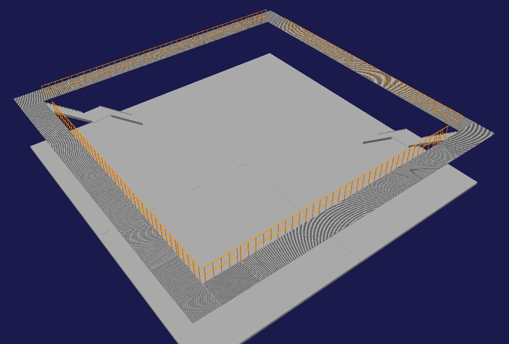
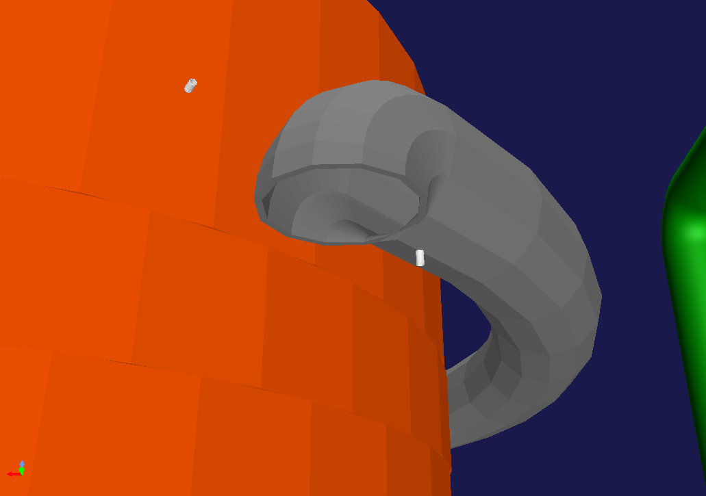
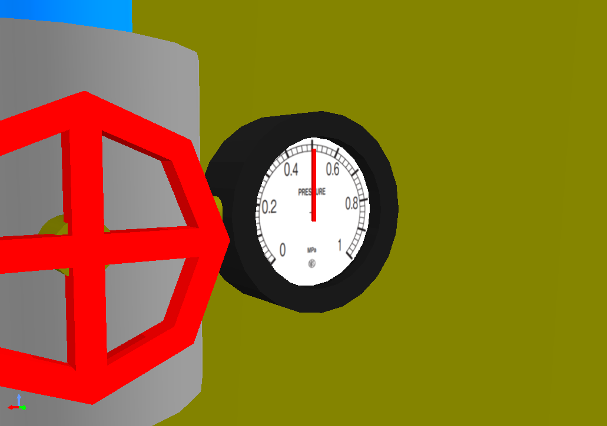
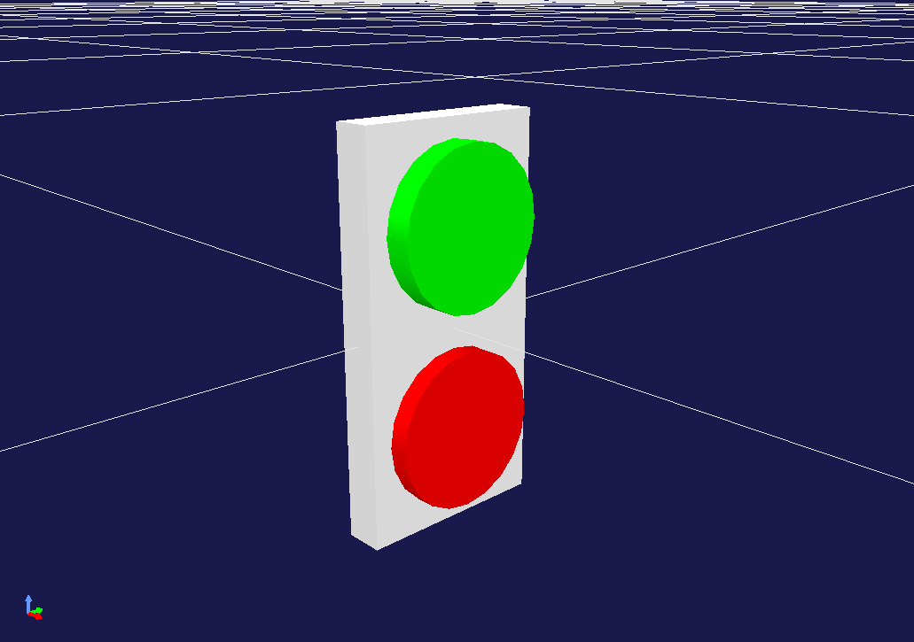
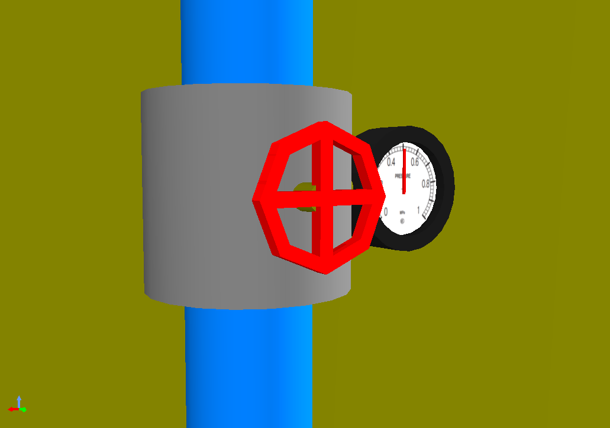
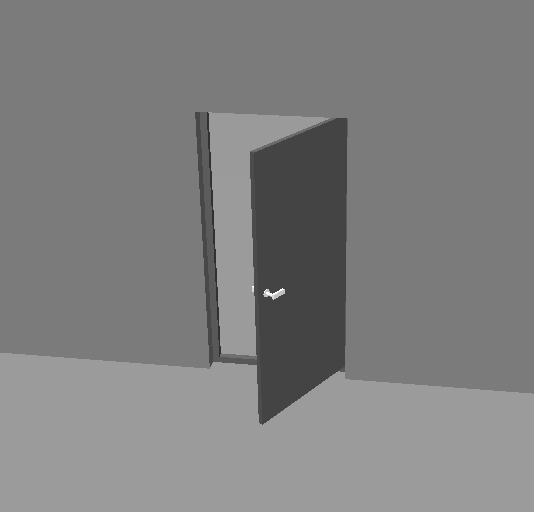
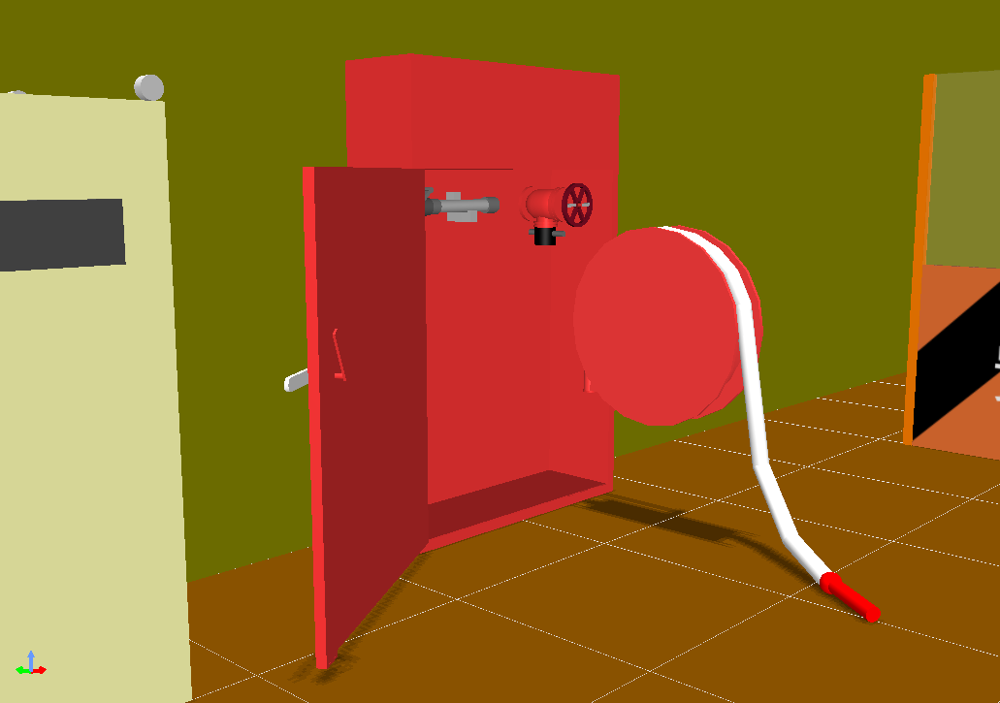
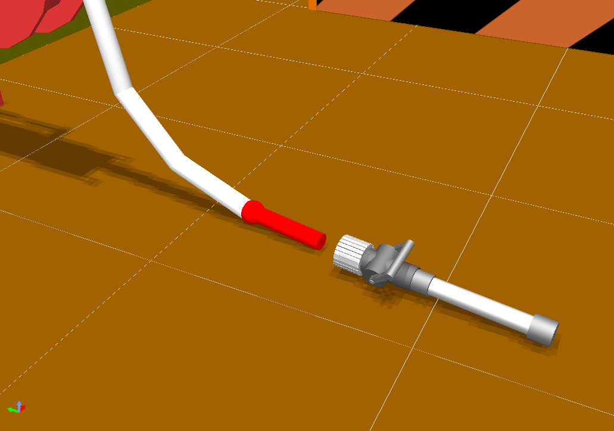
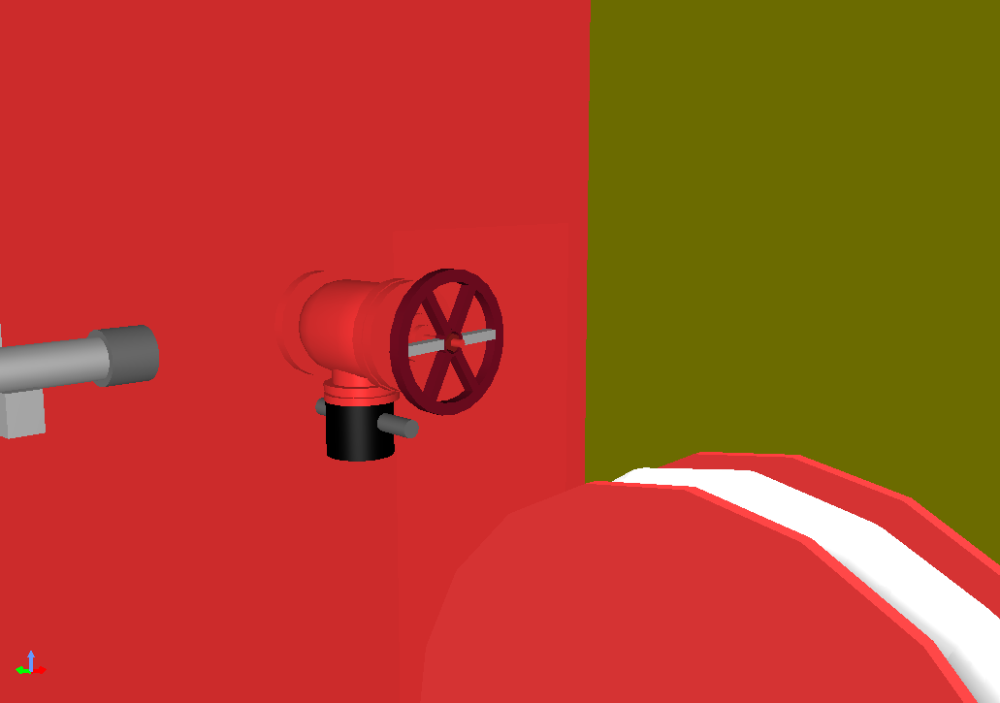
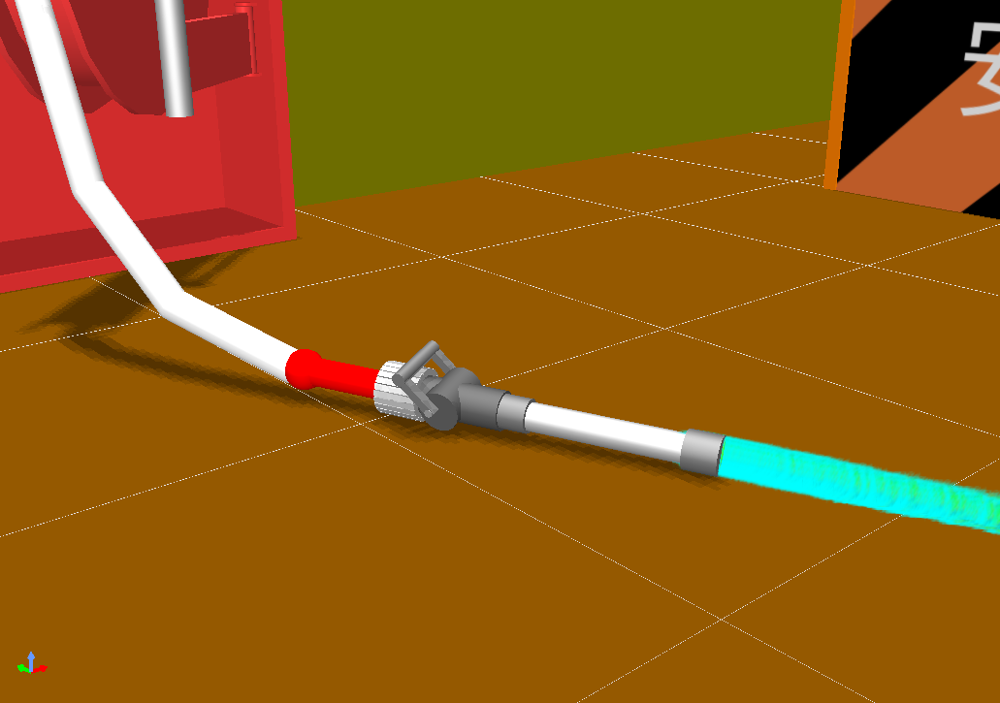

# World Robot Summit 2025 Harsh Environment F-REI Challenge, Simulation Disaster Challenge Official GitHub

## Overview
The competition at the tournament is set up with the scenario of “Information gathering and emergency response in a harsh environment, assuming a plant disaster".

## Task（Regularly update）
- We currently have built a simulation environment that takes into account the tasks required for disaster response.
- We are going to upload a simplified course that will allow you to perform each task in the future.

### Ramp


- The UGV needs to go up and down the ramp.<br>
- The UGV needs to cross the ramp.

### Catwalk


- The UGV needs to pass through the catwalk (narrow aisle).

### Duct


- The UAV enters through the duct and inspects the inside of the tank. (If there is air flow, etc., the robot close the valve first.)

### Stairs


- The UGV needs to go up and down the stairs.

### Meter


- The robot needs to read the value shown on the meter.

### QR code


- You explore the entire area and search for the QR codes as possible. The QR codes are inside the tubes.
  - The robot needs to read them.

### Switch


- The robot needs to press the specified switch.

### Valve, Lever


- The UGV needs to turn the valves and levers.
  - You can stop the fluid that is leaking by turning the valve or lever.
  - The value on the meter may change by turning the valve or lever.

### Door


- The robot needs to open the door and enter the interior.

### Fire extinguishing work
#### Step 1:


- The robot needs to open the fire extinguisher door and extract the hose.

#### Step 2:


- The robot needs to extract the nozzle and connect the nozzle and hose.

#### Step 3:


- The robot needs to open the valve inside the fire extinguishing equipment.

#### Step 4:


- The robot needs to pull the nozzle lever to extinguish the fire.

## Simulation Environment

Choreonoid is used as the robot simulator in the World Robot Summit 2025 Simulation Disaster Challenge. Moreover, AGX Dynamics is used as a physics engine.

#### AGX Dynamics installation reference
Before constructing the WRS2025 environmental specifications for Choreonoid, please install this software.
- https://choreonoid.org/ja/documents/latest/agxdynamics/install/install-agx-ubuntu.html

#### How to install Choreonoid
- Requirements
	- OS: Ubuntu22.04，CPU: amd64 (Intel CPU, Ryzen CPU)
	- ROS2: Humble Hawksbill 
	- Cannot be installed on a virtual environment on an Apple Silicon Mac (because the CPU is arm-based)
- Building Choreonoid for the competitor's computer 
	1. Building Choreonoid Without ROS2 for the first time
	2. Rebuilding Choreonoid Without ROS2 For Pre-competition (Already Choreonoid built)
	3. Building Choreonoid for pre-tournament (with ROS2 integration)


#### 1. Building Choreonoid Without ROS2 for the first time
```bash
$ cd
$ git clone https://github.com/choreonoid/choreonoid.git
$ git clone https://github.com/wrs-frei-simulation/WRS-Pre-2024.git choreonoid/ext/WRS2024PRE
$ git clone https://github.com/wrs-frei-simulation/WRS-2025.git choreonoid/ext/WRS2025
$ git clone https://github.com/k38-suzuki/hairo-world-plugin.git choreonoid/ext/hairo-world-plugin
$ choreonoid/misc/script/install-requisites-ubuntu-22.04.sh
$ cd ~/choreonoid && mkdir build && cd build
$ cmake .. -DBUILD_AGX_DYNAMICS_PLUGIN=ON -DBUILD_AGX_BODYEXTENSION_PLUGIN=ON -DBUILD_WRS2018=ON -DBUILD_SCENE_EFFECTS_PLUGIN=ON -DBUILD_HAIRO_WORLD_PLUGIN=ON -DENABLE_INSTALL_RPATH_USE_LINK_PATH=ON
$ make -j8 # -j8 for 8-core CPU, -jN for N-core CPU

# Run Choreonoid Without ROS2
$ ./bin/choreonoid
```

#### 2. Rebuilding Choreonoid Without ROS2 For WRS2025 (Already Choreonoid built)
```bash
$ cd ~
$ git clone https://github.com/wrs-frei-simulation/WRS-Pre-2024.git choreonoid/ext/WRS2024PRE
$ git clone https://github.com/wrs-frei-simulation/WRS-2025.git choreonoid/ext/WRS2025
$ git clone https://github.com/k38-suzuki/hairo-world-plugin.git choreonoid/ext/hairo-world-plugin
$ cd ~/choreonoid/build
$ cmake .. -DBUILD_AGX_DYNAMICS_PLUGIN=ON -DBUILD_AGX_BODYEXTENSION_PLUGIN=ON -DBUILD_WRS2018=ON -DBUILD_SCENE_EFFECTS_PLUGIN=ON -DBUILD_HAIRO_WORLD_PLUGIN=ON -DENABLE_INSTALL_RPATH_USE_LINK_PATH=ON
$ make -j8 # -j8 for 8-core CPU, -jN for N-core CPU

# Run Choreonoid Without ROS2
$ ./bin/choreonoid
```

#### 3. Building Choreonoid for WRS2025 (with ROS2 integration)
1. Install ROS2 (Humble Hawksbill) first.
```Bash
# Add the ROS 2 apt repository
$ sudo apt install software-properties-common
$ sudo add-apt-repository universe
$ sudo apt update && sudo apt install curl -y
$ sudo curl -sSL https://raw.githubusercontent.com/ros/rosdistro/master/ros.key -o /usr/share/keyrings/ros-archive-keyring.gpg
$ echo "deb [arch=$(dpkg --print-architecture) signed-by=/usr/share/keyrings/ros-archive-keyring.gpg] http://packages.ros.org/ros2/ubuntu $(. /etc/os-release && echo $UBUNTU_CODENAME) main" | sudo tee /etc/apt/sources.list.d/ros2.list > /dev/null

# Install ROS 2 packages
$ sudo apt update
$ sudo apt upgrade
$ sudo apt install ros-humble-desktop
$ sudo apt install ros-humble-compressed-image-transport
$ sudo apt install python3-colcon-common-extensions

# Sourcing the setup script (for bash)
$ echo "source /opt/ros/humble/setup.bash" >> ~/.bashrc
$ source ~/.bashrc
```

2. Install Choreonoid
```bash
# Clean-Build Choreonoid With ROS2
$ mkdir -p ~/ros2_ws/src
$ cd ~/ros2_ws/src
$ git clone https://github.com/choreonoid/choreonoid.git
$ git clone https://github.com/choreonoid/choreonoid_ros.git
$ git clone https://github.com/choreonoid/choreonoid_ros2_mobile_robot_tutorial.git
$ git clone https://github.com/wrs-frei-simulation/WRS-Pre-2024.git choreonoid/ext/WRS2024PRE
$ git clone https://github.com/wrs-frei-simulation/WRS-2025.git choreonoid/ext/WRS2025
$ git clone https://github.com/k38-suzuki/hairo-world-plugin.git choreonoid/ext/hairo-world-plugin
$ git clone https://github.com/k38-suzuki/choreonoid_ros2_sample_drone_tutorial.git
$ git clone https://github.com/k38-suzuki/choreonoid_joy2.git
$ choreonoid/misc/script/install-requisites-ubuntu-22.04.sh
$ cd ~/ros2_ws
$ colcon build --symlink-install --cmake-args -DBUILD_AGX_DYNAMICS_PLUGIN=ON -DBUILD_AGX_BODYEXTENSION_PLUGIN=ON -DBUILD_WRS2018=ON -DBUILD_SCENE_EFFECTS_PLUGIN=ON -DBUILD_HAIRO_WORLD_PLUGIN=ON -DENABLE_INSTALL_RPATH_USE_LINK_PATH=ON

# Run Choreonoid With ROS2
$ source install/setup.bash
$ ros2 run choreonoid_ros choreonoid
```

## Practice Environment
Once the above installation is successful, you will be able to set up a practice environment for WRS2025.


#### In the case of Choreonoid Without ROS2
- 1: Building Choreonoid Without ROS2 for the first time
- 2: Rebuilding Choreonoid Without ROS2 For WRS2025 (Already Choreonoid built)
```bash
$ cd ~
$ cd ~/choreonoid/build
$ ./bin/choreonoid ../ext/WRS2025/registration/registration_m3.yaml --wrs-util M3
```

#### In the case of Choreonoid With ROS2
- 3: Building Choreonoid for WRS2025 (with ROS2 integration)
```bash
$ cd ~
$ cd ~/ros2_ws
$ source install/setup.bash
$ ros2 run choreonoid_ros choreonoid ~/ros2_ws/src/choreonoid/ext/WRS2025/registration/registration_m3.yaml --wrs-util M3
```

## Important Notice
- Robot simulation will be performed on computers provided by the organizers (https://www.amazon.co.jp/dp/B0BTM9SYSX?language=en_US).

- Please obtain the simulation results via network communication and operate the robots on your own computers. The computers provided by the organizers will serve as servers, and the computers provided by the competitors will serve as clients.

## 2024 Pre-tournament
- 2024 Pre-tournament Official GitHub page: https://github.com/wrs-frei-simulation/WRS-Pre-2024

- Sample movie (Click on the image to view simulation on youtube)
  - Overview of the entire area
    
    [](https://www.youtube.com/watch?v=Oi1t4SQqD-A) 
	
  - Robot simulation

    [](https://www.youtube.com/watch?v=b9BqyA2T81Y)
     
  - Simulation of air duct intrusion affected by air flow

    [](https://www.youtube.com/watch?v=iCsacqRvRAQ)

- Live Broadcast
  - Preliminary contest: https://www.youtube.com/watch?v=bKAUXahBdgg
  - Final: https://www.youtube.com/watch?v=ruW7kajVFAw
