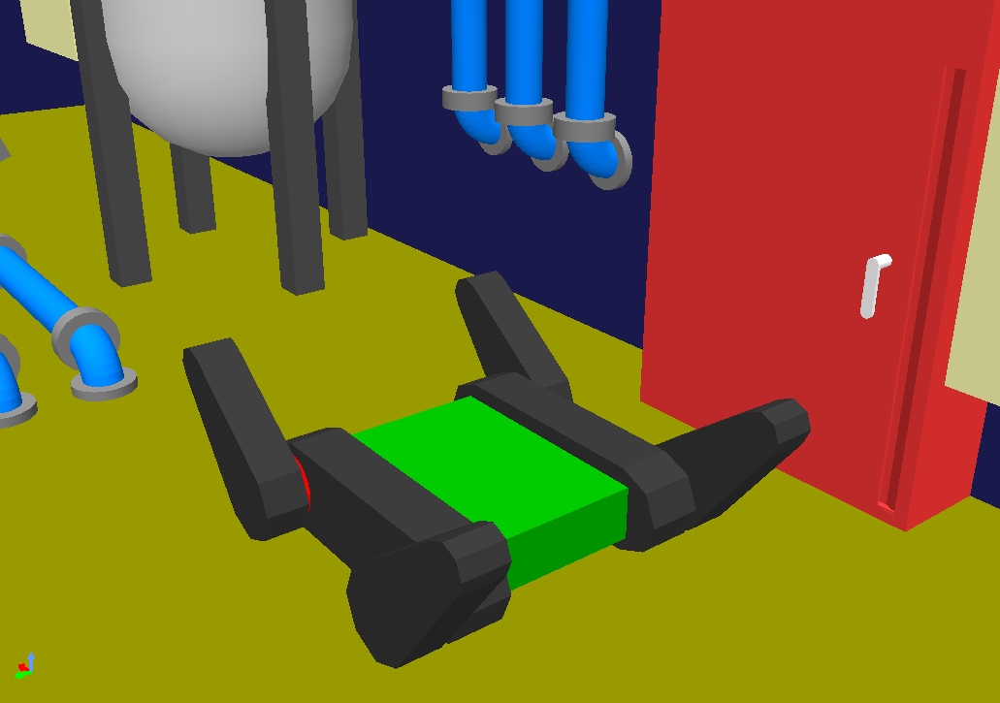

### Plant component (Update: September 3rd, 2025)
### Ramp

- The UGV needs to go up and down the ramp. 
- The UGV needs to cross the ramp.

### Catwalk

- The UGV needs to pass through the catwalk (narrow aisle).

### Duct

- The UAV enters through the duct and inspects the inside of the tank. (If there is air flow, etc., the robot close the valve first.)

### Stairs

- The UGV needs to go up and down the stairs.

### Meter

- The robot needs to read the value shown on the meter.

### QR code

- You explore the entire area and search for the QR codes as possible. The QR codes are inside the tubes.
  - The robot needs to read them.

### Switch

- The robot needs to press the specified switch.

### Valve, Lever

- The UGV needs to turn the valves and levers.
  - You can stop the fluid that is leaking by turning the valve or lever.
  - The value on the meter may change by turning the valve or lever.

### Door

- The robot needs to open the door and enter the interior.

### Truss field

Go through and explore the truss field with regular tetrahedrons and triangular prisms of pipes.
This object is constructed according to the Standard Disaster Robotics Drone Challenge.
(Ref: Standard Disaster Robotics Drone Challenge Competition field 3, https://wrs.f-rei.go.jp/en/challenge2025/sdrdh.html)

### Broken robot

- The UGV needs to move the broken robot that stopped moving. 

### Fire extinguishing work
#### Step 1:

- The robot needs to open the fire extinguisher door and extract the hose.

#### Step 2:

- The robot needs to extract the nozzle and connect the nozzle and hose.

#### Step 3:

- The robot needs to open the valve inside the fire extinguishing equipment.

#### Step 4:

- The robot needs to pull the nozzle lever to extinguish the fire.

